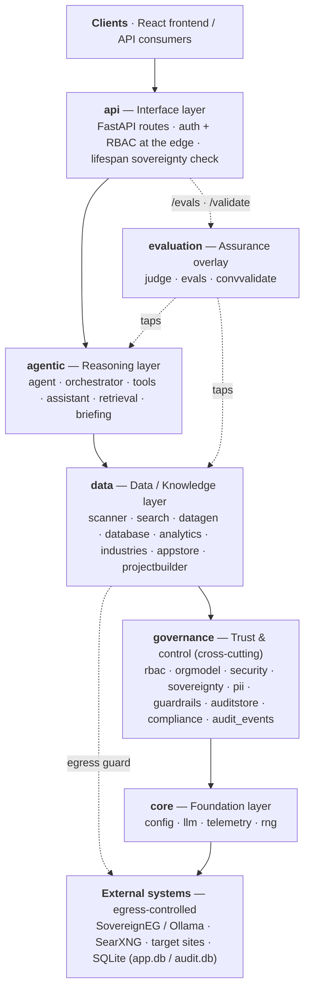

# StackLaunch AI

[](https://github.com/WaelAbouceo/stacklaunch-ai/actions/workflows/ci.yml)

Turn any website into a governed enterprise AI stack demo.

A **full-stack, LLM-driven, data-sovereign** app:

- **Frontend** (React + TypeScript + Vite) — the UI, governance, dashboards, and assistant chat.
- **Backend** (`backend/`, FastAPI) — crawls the requested site, falls back to
  **SearXNG** search when a site can't be reached, and runs **LLM** reasoning for
  industry classification and the RAG assistant.
- **LLM**: [SovereignEG](https://sovereigneg.com) (OpenAI-compatible, Egypt-billed).
  Falls back to local **Ollama** automatically when no key is set.
- **Search**: self-hosted **SearXNG** (Docker).

## Architecture

The backend is organised as a **layered sovereign stack** — dependencies only ever
point **downward** (`api → agentic → data/evaluation → governance → core`). Nothing
in a lower layer imports a higher one, so the governance and sovereignty controls
can't be bypassed.



| Layer | Responsibility | Key modules |
| --- | --- | --- |
| **api** | HTTP interface; the only layer that speaks the network. Applies auth + RBAC at the edge. | `app.py` (FastAPI) |
| **agentic** | Tool-calling agent, supervisor orchestrator, RAG assistant. | `agent`, `orchestrator`, `tools`, `assistant`, `retrieval`, `briefing` |
| **evaluation** | Assurance overlay (reached via `/api/evals`, `/api/validate`). | `judge`, `evals`, `convvalidate` |
| **data** | Site ingestion, governed DB, dataset generation, analytics. | `scanner`, `search`, `datagen`, `database`, `analytics`, `industries`, `appstore`, `projectbuilder` |
| **governance** | Cross-cutting trust: RBAC + clearance, PII redaction, prompt-injection defense, signed audit, sovereignty/egress. | `rbac`, `orgmodel`, `security`, `sovereignty`, `pii`, `guardrails`, `auditstore`, `compliance`, `audit_events` |
| **core** | Foundation: config, LLM client, telemetry, deterministic RNG. | `config`, `llm`, `telemetry`, `rng` |

**Sovereignty boundaries** — the only sanctioned egress is inference (→ SovereignEG/Ollama),
web search (→ SearXNG), and site scanning (→ user URLs, behind an SSRF/egress guard).
Everything else (datasets, audit, app state) stays in local SQLite. Inspect the live
posture at `GET /api/sovereignty`, or in-app via the **Sovereign Stack** tab.

## What's real vs. generated

| Part | Source |
| --- | --- |
| Website crawl, company name, description, pages | **Real** — scraped live, or via SearXNG when the site is unreachable |
| Industry classification | **Real LLM** — classified from the real content |
| Knowledge base | **Real** — the actual pages we indexed |
| Assistant answers | **Real LLM (RAG)** — grounded in the pages + a PII-safe data summary, with SearXNG fallback |
| CRM / ERP / Ticketing datasets | **Generated** — private internal systems we can't crawl |

## Flow

1. Enter a URL → **"Check website"**.
2. Backend crawls it (or searches via SearXNG if blocked), then the LLM extracts
   the real company name, description, and industry. A **confirmation screen**
   shows what we understood (e.g. `cib.com` → corrected to CIB / Banking). Fix
   the URL or industry if needed.
3. Confirm → generate the governed stack and open the dashboard + LLM assistant.

## Run (three processes)

### 1. SearXNG (search fallback)

```bash
cd backend
docker compose up -d        # serves http://localhost:8080
```

### 2. Backend (FastAPI + LLM)

```bash
cd backend
python3 -m venv .venv
source .venv/bin/activate
pip install -r requirements.txt
cp .env.example .env         # then add your SovereignEG key (or leave blank for Ollama)
uvicorn main:app --reload --port 8000
```

Check `GET http://localhost:8000/api/health` — it reports the active LLM provider
and whether SearXNG is reachable.

### 3. Frontend (Vite)

```bash
npm install
npm run dev                  # http://localhost:5173, proxies /api -> :8000
```

## Configuration (`backend/.env`)

```
LLM_BASE_URL=https://sovereigneg.com/v1
LLM_API_KEY=sk-...           # from sovereigneg.com; blank => use local Ollama
LLM_MODEL=gpt-4o-mini        # any id from the SovereignEG catalog
OLLAMA_BASE_URL=http://localhost:11434/v1
OLLAMA_MODEL=qwen2.5:7b
SEARXNG_URL=http://localhost:8080
```

The app degrades gracefully: no LLM → keyword industry detection + templated
answers; no SearXNG → direct-crawl only.

## Tests

Both run in CI on every push/PR (see the badge above).

```bash
# Backend — 119 tests, fully offline (no LLM/network needed)
cd backend
pip install -r requirements-dev.txt
python -m pytest -q

# Frontend — type safety
npm ci
npx tsc -b
```
